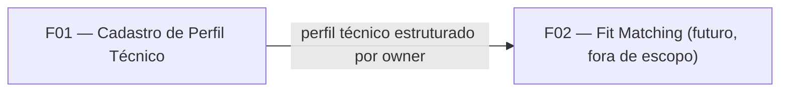

# PRD — F01: Cadastro de Perfil Técnico Estruturado

**Projeto:** Fit Analizer
**Status:** Rascunho para implementação
**Data:** 2026-08-10

## 1. Sumário executivo

O Fit Analizer é um backend Java/Spring Boot que analisa o fit entre uma vaga
de emprego e um perfil técnico, usando a Claude API. Para que essa análise
seja possível, o sistema precisa de uma fonte de dados estruturada e
confiável sobre o perfil técnico de cada usuário — em vez de depender de
texto livre de currículo, que é ambíguo e difícil de comparar de forma
consistente com os requisitos de uma vaga.

Esta feature (F01) implementa o cadastro desse perfil técnico: uma API REST
com operações de CRUD completo (criar, consultar, atualizar, deletar),
persistida em PostgreSQL, suportando os dois usuários do sistema (uso
pessoal, sem necessidade de autenticação em v1). É a primeira feature do
projeto e a base de dados sobre a qual a futura feature de fit-matching será
construída.

## 2. Problema

Para comparar uma vaga de emprego com o perfil técnico de um candidato de
forma consistente entre múltiplas análises, é preciso que o perfil técnico
exista como dado estruturado e comparável (ex: "3 anos de Java"), não como
texto livre de currículo, que exige reinterpretação subjetiva a cada análise
e não garante comparações consistentes ao longo do tempo. Hoje esse dado não
existe em lugar nenhum do sistema — não há persistência, não há modelo de
dados, não há forma de consultar ou atualizar essas informações.

## 3. Oportunidade

Modelar o perfil técnico como dado estruturado desde o início:
- Permite comparação direta e não ambígua com requisitos de vaga (ex: "vaga
  pede 3+ anos de Java" vs. "candidato tem 4 anos de Java").
- Evita retrabalho de migração de dado não estruturado para estruturado mais
  tarde, quando a feature de fit-matching for implementada.
- Estabelece a base de dados para todas as features seguintes do produto,
  que dependem de um perfil técnico consultável.

## 4. Audiência

- **Quem usa:** duas pessoas, uso pessoal (o autor do sistema e sua esposa).
- **Necessidade:** manter um registro estruturado e atualizável do próprio
  perfil técnico (skills e histórico profissional), que sirva de insumo
  para análises de fit com vagas.
- **Experiência esperada:** interação via chamadas diretas à API REST (sem
  interface própria em v1) — os usuários (ou ferramentas que eles usam,
  como scripts ou clientes HTTP) cadastram e mantêm o perfil atualizado
  conforme mudanças reais na carreira (nova skill, novo emprego).
- **Nível técnico:** usuários técnicos, confortáveis interagindo com uma API
  REST diretamente (sem necessidade de UI amigável nesta fase).

## 5. Objetivos e métricas

| Objetivo | Métrica |
|---|---|
| Cada usuário consegue manter um perfil técnico estruturado e atualizado | 1 perfil ativo por owner, atualizável a qualquer momento |
| O dado é confiável o suficiente para alimentar comparações futuras | 100% dos perfis persistidos com skills (nome + anos) e histórico profissional estruturados, sem depender de texto livre |
| Nenhuma perda acidental de dado | Nenhuma sobrescrita silenciosa de perfil existente (criação duplicada é bloqueada, não substitui) |

**Assumption:** por se tratar de um projeto de uso pessoal em fase inicial,
não há meta de volume de uso ou SLA de disponibilidade — o critério de
sucesso é funcional (a API se comporta como especificado), não operacional.

## 6. Features

### F01 — Cadastro de Perfil Técnico Estruturado

**O que faz:** expõe uma API REST para criar, consultar, atualizar e
deletar o perfil técnico de um usuário (`owner`), persistido em PostgreSQL.

**Dados do perfil:**
- `owner` (identificador simples do dono do perfil — string, sem
  autenticação associada)
- `bio` — resumo/bio curto em texto livre
- `skills` — lista de itens `{ nome, anosExperiencia }`
- `historicoProfissional` — lista de itens `{ empresa, cargo, periodo,
  tecnologiasUsadas }`

**Operações e experiência esperada:**

| Operação | Comportamento esperado |
|---|---|
| Criar perfil | Recebe `owner` + dados do perfil. Se já existe perfil para esse `owner`, a operação é **bloqueada com erro** (não sobrescreve). Se não existe, cria e persiste. |
| Consultar perfil | Recebe `owner`, retorna o perfil estruturado completo (skills, histórico, bio). Se não existe perfil para o `owner`, retorna erro de não encontrado. |
| Atualizar perfil | Recebe `owner` + apenas os campos que devem ser alterados (atualização parcial). Campos não enviados permanecem inalterados. Se não existe perfil para o `owner`, retorna erro de não encontrado (não cria implicitamente). |
| Deletar perfil | Recebe `owner`, remove o perfil correspondente. Se não existe, retorna erro de não encontrado. |

**Tratamento de erro:**
- Criar perfil para `owner` que já possui perfil → erro de conflito (não
  sobrescreve, não cria duplicata).
- Consultar, atualizar ou deletar perfil de `owner` inexistente → erro de
  não encontrado.
- `owner` ausente ou vazio na requisição → erro de requisição inválida.

**Assumption:** os códigos HTTP exatos (400/404/409) e o contrato detalhado
de request/response ficam para a especificação técnica em `docs/specs/`,
não fazem parte deste PRD.

## 7. User stories

- Como usuário do Fit Analizer, quero cadastrar meu perfil técnico
  (skills, histórico profissional e bio) para que ele fique disponível
  para futuras análises de fit com vagas.
- Como usuário do Fit Analizer, quero consultar meu perfil técnico
  cadastrado para conferir os dados que estão salvos.
- Como usuário do Fit Analizer, quero atualizar meu perfil técnico quando
  eu ganhar uma nova skill ou mudar de emprego, sem precisar apagar e
  recriar todo o cadastro.
- Como usuário do Fit Analizer, quero deletar meu perfil técnico caso
  precise refazer a modelagem dos dados do zero.
- Como usuário do Fit Analizer, quero que uma tentativa de criar um
  segundo perfil para o mesmo owner seja bloqueada, para não perder
  acidentalmente os dados do perfil que já existe.
- Como sistema Fit Analizer, quero manter os perfis técnicos de owners
  diferentes isolados entre si, mesmo sem autenticação, para que os
  dados de cada pessoa não se misturem.

## 8. Consumes/Provides

### F01 — Cadastro de Perfil Técnico Estruturado

**Consumes:** nada — é a primeira feature do sistema, não depende de
nenhuma outra feature existente.

**Provides:**
- Para a futura feature de **Fit Matching** (comparação vaga x perfil):
  fornece o perfil técnico estruturado de um `owner` (skills com anos de
  experiência, histórico profissional, bio) para ser usado como insumo na
  análise de fit via Claude API.
- Estabelece o identificador `owner` como chave de acesso ao perfil, que
  deverá ser reutilizado por qualquer feature futura que precise associar
  dados a uma pessoa específica do sistema.

**Assumption:** a feature de Fit Matching ainda não tem PRD próprio; é
referenciada aqui apenas como consumidora futura do dado produzido por F01,
para deixar explícita a integração pretendida.

## 9. Fora de escopo

- **Autenticação/autorização real** (login, senha, tokens) — o `owner` é
  apenas um identificador de separação de dados, não um mecanismo de
  segurança.
- **Interface de usuário (web/mobile)** — v1 é exclusivamente API REST.
  Frontend é considerado para v2, após validação do core de fit-matching.
- **Múltiplos perfis por owner** (ex: perfis diferentes por área de
  atuação) — hoje é 1 perfil por owner, sem exceção.
- **Dados pessoais de identificação** (nome, e-mail, telefone) — não há
  necessidade funcional para eles nesta feature (sem autenticação, sem
  geração de currículo/CV).
- **Upload ou processamento de currículo em texto livre** — o cadastro é
  sempre estruturado, não há campo de currículo livre nem parsing de PDF/DOC.
- **Formação acadêmica, certificações e idiomas** como campos do perfil —
  não incluídos nesta versão; podem ser adicionados futuramente se se
  mostrarem relevantes para o matching.
- **A própria feature de Fit Matching** (comparação vaga x perfil via
  Claude API) — é a consumidora deste dado, mas sua especificação é objeto
  de um PRD futuro, não deste documento.
- **Histórico de alterações / versionamento do perfil** — cada atualização
  sobrescreve o valor anterior dos campos alterados; não há trilha de
  auditoria, log de mudanças ou versões anteriores armazenadas.
