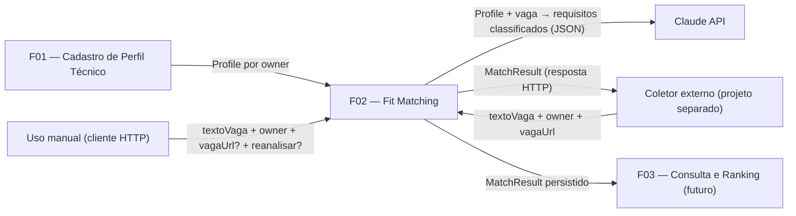

# PRD — F02: Fit Matching

**Projeto:** Fit Analizer
**Status:** Rascunho para implementação
**Data:** 2026-09-28
**PRD relacionado:** `docs/prd/F01-cadastro-perfil-tecnico.md` (fornece o Profile consumido aqui)

## 1. Sumário executivo

A F02 analisa **uma** vaga de emprego contra o Profile técnico de um `owner`
(cadastrado pela F01) e persiste o resultado como um `MatchResult`. A análise
é dividida entre dois responsáveis com papéis bem separados:

- **Claude API** faz apenas o julgamento: extrai os requisitos obrigatórios da
  vaga e classifica a cobertura de cada um pelo Profile, apontando a evidência.
- **Código Java** faz todo o resto: verifica se a evidência citada existe de
  fato no Profile, calcula a aderência percentual, define a decisão por faixas
  e marca resultados que merecem revisão humana.

A feature expõe um **único endpoint**, usado tanto para vagas coladas à mão
quanto para vagas enviadas por um coletor externo (projeto separado). Como o
coletor reenvia as mesmas vagas a cada execução, a F02 deduplica por
`owner + vaga` antes de chamar a Claude API, evitando custo repetido.

Consultar e ranquear resultados é responsabilidade da F03, fora deste PRD.

## 2. Problema

Com o Profile estruturado da F01 disponível, falta a parte que dá sentido ao
sistema: dizer, para uma vaga concreta, **o quanto o perfil cobre o que a vaga
exige** e **o que fazer a respeito** (priorizar, candidatar com carta, não
candidatar). Fazer isso manualmente para cada vaga é lento e inconsistente.

Delegar a análise inteira a um LLM cria outros problemas:
- números calculados por LLM não são reprodutíveis nem auditáveis;
- o LLM pode inventar evidência ("tem experiência com Kafka") que não existe
  no perfil, inflando o resultado;
- um coletor automático reenviaria a mesma vaga a cada execução, multiplicando
  o custo de chamadas à API sem gerar informação nova.

## 3. Oportunidade

- **Julgamento no LLM, regra no código:** o LLM faz o que só ele faz bem
  (interpretar texto livre de vaga e relacionar com o perfil); o código faz o
  que precisa ser determinístico (conta, faixas, verificação). O número final
  é explicável e testável com JUnit.
- **Verificação barata de alucinação:** conferir se a evidência citada existe
  no Profile não custa nenhuma chamada extra de LLM e elimina a principal fonte
  de resultado inflado.
- **Um endpoint para dois usos:** o mesmo contrato atende o uso manual e o
  coletor, sem duplicar lógica.
- **Dedup antes da chamada:** o custo da Claude API passa a ser proporcional a
  vagas *novas*, não a execuções do coletor.

## 4. Audiência

- **Quem usa:**
  - os dois usuários do sistema (mesmos da F01), colando o texto de uma vaga
    manualmente para análise pontual;
  - o **coletor externo** (projeto separado, stateless, sem banco próprio), que
    busca vagas em APIs públicas de emprego e as envia ao mesmo endpoint.
- **Necessidade:** saber rapidamente se vale a pena se candidatar a uma vaga,
  com qual esforço (CV apenas, CV + carta, CV + carta com aviso) e quais gaps
  ou riscos existem.
- **Experiência esperada:** uma chamada HTTP com o texto da vaga devolve o
  resultado completo (aderência, decisão, requisitos classificados, gaps e
  riscos, marca de revisão). Reenviar a mesma vaga devolve o resultado salvo,
  instantaneamente e sem custo. Sem interface própria em v1, como na F01.
- **Nível técnico:** usuários técnicos, confortáveis com API REST.

## 5. Objetivos e métricas

| Objetivo | Métrica |
|---|---|
| A análise concorda com o julgamento humano | Conjunto de regressão de **10 a 15 vagas reais julgadas à mão** pelo usuário; a análise discorda do usuário em **no máximo 3 de 15** vagas. Executado **sempre que o prompt mudar**. |
| Nenhuma evidência inventada chega ao cálculo | 100% das `evidencia_ref` que não existem no Profile são rebaixadas para `nenhum` e registradas no log como alucinação |
| Custo proporcional a vagas novas | 0 chamadas à Claude API para `owner + vaga_chave` já analisados (exceto com `reanalisar=true`) |
| Resultado reprodutível a partir da resposta do LLM | Dada a mesma lista de requisitos classificados, `aderenciaPct` e `decisao` são sempre os mesmos (cálculo 100% em código, coberto por testes unitários) |
| Casos duvidosos ficam visíveis | Todo resultado em zona de fronteira, com rebaixamento por alucinação ou inconclusivo é persistido com `revisar = true` |

**Assumption:** "discordar" no conjunto de regressão significa a `decisao`
produzida ser diferente da decisão que o usuário atribuiu à vaga (e não
diferença pontual de percentual).

**Assumption:** a proporção de resultados com `revisar = true` que dispara a
fase 2 (ver seção 9) não foi quantificada; valor inicial sugerido de **30%**
dos resultados, a calibrar com o uso real.

## 6. Features

### F02 — Fit Matching

**O que faz:** recebe o texto bruto de uma vaga, o `owner` e, opcionalmente, a
URL da vaga; analisa a vaga contra o Profile do `owner` via Claude API; aplica
verificação e cálculo em código; persiste e devolve um `MatchResult`.

#### 6.1 Contrato de entrada (um único endpoint)

| Campo | Obrigatório | Descrição |
|---|---|---|
| `owner` | sim | Identificador do dono do Profile (mesmo da F01) |
| `textoVaga` | sim | Texto bruto da vaga |
| `vagaUrl` | não | URL da vaga. Sempre enviada pelo coletor; opcional no uso manual |
| `reanalisar` | não | Parâmetro opcional. Quando `true`, ignora o dedup e sobrescreve o resultado existente. O coletor **nunca** envia |

O uso manual e o coletor chamam **o mesmo endpoint** com **o mesmo contrato**.
Não existe endpoint separado para o coletor.

**Assumption:** o formato exato (body JSON vs. query param para `reanalisar`,
path, códigos HTTP) fica para a Spec em `docs/specs/`.

#### 6.2 Chave da vaga e dedup

- `vaga_chave` é **sempre preenchida (NOT NULL)**:
  - `vagaUrl`, quando informada;
  - caso contrário, `"hash:"` + SHA-256 do texto normalizado.
- **Normalização antes do hash:** minúsculas, trim, e colapso de espaços e
  quebras de linha em um único espaço.
- **Defesa em profundidade (mesmo padrão da F01):**
  1. **Service:** antes de chamar a Claude API, busca `MatchResult` por
     `profile + vaga_chave`. Se existir e `reanalisar` não for `true`, devolve
     o resultado salvo **sem chamar a Claude API**.
  2. **Banco:** constraint `UNIQUE (profile_id, vaga_chave)`. Como a coluna é
     NOT NULL, não há o furo de `NULL` não conflitar com `NULL` no PostgreSQL.
- **Concorrência:** se duas requisições da mesma vaga passarem pela verificação
  do Service e a segunda falhar na constraint UNIQUE, a segunda **devolve o
  resultado já salvo**, e não erro.
  - **Divergência consciente da F01:** a F01 devolve 409 nesse cenário. A F02
    não, porque o coletor precisa de **idempotência**: reenviar a mesma vaga
    deve sempre resultar no mesmo `MatchResult`, nunca em erro. Custo aceito:
    uma chamada à Claude API desperdiçada nesse caso raro.

**Custos aceitos conscientemente:**
- Uma colagem manual com diferença real de conteúdo gera outro hash e é
  reanalisada (custo: uma chamada extra, sem risco de dado errado).
- A mesma vaga enviada pelo coletor (chave = URL) e colada à mão sem URL
  (chave = hash) conta como **duas** análises — não há como ligá-las sem a URL.

**Assumption:** a URL é usada como chave **exatamente como chega**, sem
normalização (ex: parâmetros de rastreio como `?utm=` geram chaves diferentes).
Aceitável porque o coletor reenvia a URL da API de origem sempre igual.

#### 6.3 Reanálise (`reanalisar=true`)

- Ignora o dedup, chama a Claude API e **sobrescreve a mesma linha** do
  `MatchResult` (a UNIQUE continua valendo).
- Na sobrescrita, também são atualizados: versão do prompt, modelo usado e
  `analisadoEm`.
- Uso exclusivamente manual; o coletor nunca envia.

**Risco aceito:** um resultado salvo fica **desatualizado** depois de uma
edição no Profile (F01) até o usuário pedir a reanálise. Não há invalidação
automática nem endpoint de exclusão em v1.

**Gatilho de revisão:** se reanalisar vagas uma a uma virar trabalho
repetitivo, ou se resultados desatualizados forem parar em decisões reais de
candidatura, avaliar invalidação por marcador de versão do Profile ou
reanálise em lote.

**Assumption:** `reanalisar=true` para uma vaga sem resultado prévio analisa e
cria normalmente, sem erro.

#### 6.4 Divisão de trabalho: Claude API × código

**Claude API (somente julgamento), resposta sempre em JSON estruturado, nunca
texto livre:**
- `requisitos`: lista de **todos** os requisitos **obrigatórios** da vaga,
  **inclusive os sem cobertura** (o código precisa do denominador). Cada item:
  - descrição do requisito;
  - classificação: `forte`, `parcial` ou `nenhum`;
  - `evidencia_ref`: qual skill ou experiência do Profile sustenta a
    classificação (quando houver).
- `gaps_riscos`: lista de `{ gap, risco }`.

Requisitos desejáveis **não** são pedidos à Claude nem exibidos em v1.

**Código Java (todo o resto):**
1. **Verificação de evidência** (seção 6.5).
2. **Cálculo da aderência:**
   `aderenciaPct = (soma dos pesos dos obrigatórios / total de obrigatórios) × 100`,
   com `forte = 1.0`, `parcial = 0.5`, `nenhum = 0`, **arredondando sempre
   para baixo** (resultado inteiro). O cálculo usa as classificações **já
   verificadas** (após rebaixamentos).
3. **Decisão por faixas:**

   | aderenciaPct | decisao |
   |---|---|
   | 85–100 | `cv_prioritario` |
   | 70–84 | `cv_carta` |
   | 50–69 | `cv_carta_com_aviso` |
   | 30–49 | `nao_candidatar` |
   | 0–29 | `fora_escopo` |

4. **Marca de revisão** (seção 6.6).

#### 6.5 Verificação de evidência (v1, sem custo de LLM)

Regra: **a Claude nunca pode inventar evidência.**

- Após a resposta, o código confere se cada `evidencia_ref` existe de fato no
  Profile **daquele owner** (skill ou experiência profissional).
- Se não existir: o requisito é **rebaixado para `nenhum`**, o evento é
  registrado no log como **alucinação**, e a análise **segue** (não rejeita a
  análise inteira).

**Assumption:** requisito classificado como `forte` ou `parcial` **sem**
`evidencia_ref` recebe o mesmo tratamento de alucinação (rebaixado para
`nenhum` e logado). Requisito `nenhum` não precisa de referência.

**Assumption:** a regra exata de correspondência entre `evidencia_ref` e o
Profile (ex: nome de skill com ou sem distinção de maiúsculas, como
referenciar uma experiência) é definida na Spec.

**Assumption:** a referência inválida vai apenas para o log; o requisito
persiste como `nenhum`, sem a referência rejeitada.

#### 6.6 Marca `revisar`

`revisar = true` quando **qualquer** das condições abaixo ocorrer:
- `aderenciaPct` em zona de fronteira de decisão: **28–32, 48–52, 68–72,
  83–87**;
- algum requisito foi **rebaixado** por evidência inexistente no Profile;
- a análise é **inconclusiva** (seção 6.7).

#### 6.7 Vaga sem requisitos obrigatórios / texto que não é vaga

Quando a Claude não identifica nenhum requisito obrigatório (vaga genérica
demais) ou o texto enviado não parece ser uma vaga:
- persiste com `aderenciaPct = 0`, `decisao = fora_escopo`, `revisar = true`;
- `gaps_riscos` recebe a entrada fixa:
  `{ gap: "sem requisitos obrigatórios identificáveis", risco: "análise inconclusiva, o número não vem de um cálculo real" }`;
- o evento é registrado no log.

Motivo: persistir faz o dedup proteger contra reprocessamento pelo coletor;
se o prompt melhorar depois, `reanalisar=true` corrige a vaga.

**Assumption:** a Claude sinaliza "não é uma vaga" devolvendo a lista de
requisitos obrigatórios vazia, e o código trata os dois casos pelo mesmo
caminho.

**Gatilho de revisão:** se, na F03, resultados inconclusivos forem confundidos
com 0% legítimos, criar um valor de decisão próprio (`inconclusiva`) e deixar
`aderenciaPct` nulo.

#### 6.8 Entidade `MatchResult`

| Campo | Descrição |
|---|---|
| `id` | Identificador |
| `profile` | `@ManyToOne` para o `Profile` da F01 |
| `vagaChave` | NOT NULL. URL ou `"hash:" + SHA-256`. Parte da UNIQUE `(profile_id, vaga_chave)` |
| `vagaUrl` | URL da vaga em coluna própria, **nula quando não informada**. Para exibição na F03 |
| `aderenciaPct` | Inteiro 0–100, calculado em código |
| `requisitos` | Todos os obrigatórios classificados (`forte`/`parcial`/`nenhum`), com `evidencia_ref` quando houver |
| `gapsRiscos` | Lista de `{ gap, risco }` |
| `decisao` | Uma das 5 decisões da seção 6.4 |
| `revisar` | Marca de revisão humana (seção 6.6) |
| `versaoPrompt` | Versão do prompt usada na análise vigente |
| `modelo` | Modelo da Claude usado na análise vigente |
| `analisadoEm` | Data/hora da análise vigente (atualizada na reanálise) |

O texto da vaga **não é persistido** — apenas o hash, quando usado como chave.

**Assumption:** o campo de data se chama `analisadoEm` (e não `createdAt`)
porque é atualizado na reanálise; o nome precisa refletir "quando a análise
vigente foi feita", não "quando a linha foi criada".

**Assumption:** a forma de armazenar `requisitos` e `gapsRiscos` (tabela
filha, `@ElementCollection` ou coluna JSON) é decisão da Spec.

#### 6.9 Tratamento de erro

| Situação | Comportamento |
|---|---|
| `owner`, `textoVaga` ausentes ou vazios | Erro de requisição inválida; nada é chamado nem persistido |
| `owner` sem Profile cadastrado | Erro de não encontrado; **não chama** a Claude API |
| Resultado já existe (sem `reanalisar`) | Devolve o resultado salvo; não é erro |
| Violação da UNIQUE por concorrência | Devolve o resultado já salvo; não é erro (seção 6.2) |
| Evidência inexistente no Profile | Não é erro: rebaixa, loga, `revisar = true` |
| Nenhum requisito obrigatório / texto não é vaga | Não é erro: resultado inconclusivo persistido (seção 6.7) |

**Assumption:** falha da Claude API (erro HTTP, timeout ou JSON inválido/fora
do schema) devolve erro ao cliente, **nada é persistido** e **não há retry
automático** em v1. O coletor tenta de novo na próxima execução.

**Assumption:** códigos HTTP exatos e formato do corpo de erro ficam para a
Spec.

#### 6.10 Arquitetura e segurança (herdadas da F01)

- Camadas simples **Controller → Service → Repository**, como na F01.
- O cliente da Claude API fica atrás de uma interface (`FitAnalysisClient`);
  detalhes na Spec.
- **Chave da Claude API somente por variável de ambiente**, nunca no código
  nem no repositório.
- **Risco aceito de IDOR:** sem autenticação, quem souber o `owner` de outra
  pessoa consegue disparar análises (e gastar chamadas) contra o Profile dela.
  Mesma condição de reversão da F01: se a API for exposta fora de ambiente
  privado, autenticação real passa a ser pré-requisito.

#### 6.11 Critérios de aceitação

- Uma vaga nova é analisada, persistida e devolvida com todos os campos da
  seção 6.8.
- Reenviar a mesma vaga (mesma URL, ou mesmo texto normalizado sem URL) para o
  mesmo owner devolve o resultado salvo **sem chamar** a Claude API.
- `reanalisar=true` chama a Claude API e sobrescreve a mesma linha, atualizando
  versão do prompt, modelo e `analisadoEm`.
- `aderenciaPct` e `decisao` batem com a fórmula e as faixas para qualquer
  combinação de classificações (testes unitários, incluindo arredondamento
  para baixo e limites de faixa).
- `evidencia_ref` inexistente no Profile rebaixa o requisito para `nenhum`,
  gera log de alucinação e marca `revisar = true`.
- Resultados em 28–32, 48–52, 68–72, 83–87 são persistidos com
  `revisar = true`.
- Vaga sem obrigatórios persiste 0% / `fora_escopo` / `revisar = true` com a
  entrada fixa em `gaps_riscos`.
- Owner sem Profile não gera chamada à Claude API.
- O conjunto de regressão de 10–15 vagas existe e é executado quando o prompt
  muda, com no máximo 3 discordâncias em 15.

## 7. User stories

- Como usuário, quero colar o texto de uma vaga (com ou sem URL) e receber a
  aderência, a decisão, os requisitos classificados e os gaps/riscos, para
  decidir rápido se e como me candidatar.
- Como usuário, quero que a análise nunca conte como coberta uma skill ou
  experiência que eu não tenho no meu Profile, para não me candidatar com base
  em um número inflado.
- Como usuário, quero que resultados perto de uma fronteira de decisão, com
  evidência rebaixada ou inconclusivos venham marcados para revisão, para
  saber onde meu julgamento ainda é necessário.
- Como usuário, quero pedir a reanálise de uma vaga depois de atualizar meu
  Profile ou depois de uma melhoria no prompt, sem criar resultado duplicado.
- Como coletor, quero enviar vagas ao mesmo endpoint do uso manual e receber
  sempre o mesmo resultado para uma vaga já analisada, sem erro e sem custo
  novo, para poder rodar repetidamente sem guardar estado.
- Como mantenedor, quero um conjunto de vagas julgadas à mão que sirva de
  teste de regressão sempre que o prompt mudar, para detectar piora de
  qualidade antes de ela afetar decisões reais.

## 8. Consumes/Provides

### F02 — Fit Matching

**Consumes:**
- **F01 — Cadastro de Perfil Técnico:** o `Profile` do `owner` (skills com
  anos de experiência, histórico profissional com tecnologias usadas, bio).
  Usado em dois momentos:
  1. como insumo enviado à Claude API para a classificação;
  2. como fonte de verdade na verificação de `evidencia_ref`.
- **Identificador `owner`** definido pela F01, reutilizado como chave de acesso.
- **Claude API** (externa), via `FitAnalysisClient`, com chave por variável de
  ambiente.
- **Coletor externo** (fora deste PRD): origem de vagas automáticas, como
  cliente HTTP do endpoint.

**Provides:**
- **Para a F03 (consulta e ranking):** `MatchResult` persistido por
  `profile`, com `aderenciaPct`, `decisao`, `revisar`, `requisitos`,
  `gapsRiscos`, `vagaUrl` (para exibição), `versaoPrompt`, `modelo` e
  `analisadoEm`. Garantia: no máximo **um** resultado por
  `(profile, vaga_chave)`.
- **Para o coletor:** o `MatchResult` como resposta HTTP do mesmo endpoint,
  idempotente para a mesma vaga.

**Nota de integração com a F01:** como `MatchResult` tem `@ManyToOne` para
`Profile`, deletar um Profile na F01 precisa considerar os `MatchResult`
associados. **Assumption:** o comportamento (cascade na exclusão ou bloqueio)
é decidido na Spec da F02; hoje a F01 não conhece `MatchResult`.

## 9. Fora de escopo

- **Segunda camada de LLM (revisor)** que valida ou refina a primeira análise,
  de preferência com outro modelo e rubrica explícita. Registrada como
  **fase 2**, com gatilho:
  - a Claude discordar do usuário em **mais de 3 de 15** vagas do conjunto de
    teste julgado à mão; **ou**
  - a proporção de resultados com `revisar = true` for grande (ver Assumption
    na seção 5).
- **Consulta e ranking de resultados** — F03.
- **O coletor** — projeto separado; aqui aparece apenas como cliente HTTP.
- **Persistir o texto da vaga** no `MatchResult` — apenas o hash, quando usado
  como chave.
- **Requisitos desejáveis** — não pedidos à Claude nem exibidos em v1.
- **Invalidação automática** de resultados quando o Profile muda.
- **Endpoint de exclusão** de `MatchResult`.
- **Reanálise em lote.**
- **Normalização de URL** (remoção de parâmetros de rastreio etc.).
- **Retry automático** de chamadas à Claude API.
- **Endpoint separado para o coletor.**
- **Autenticação/autorização real** — mesmo risco aceito da F01.
